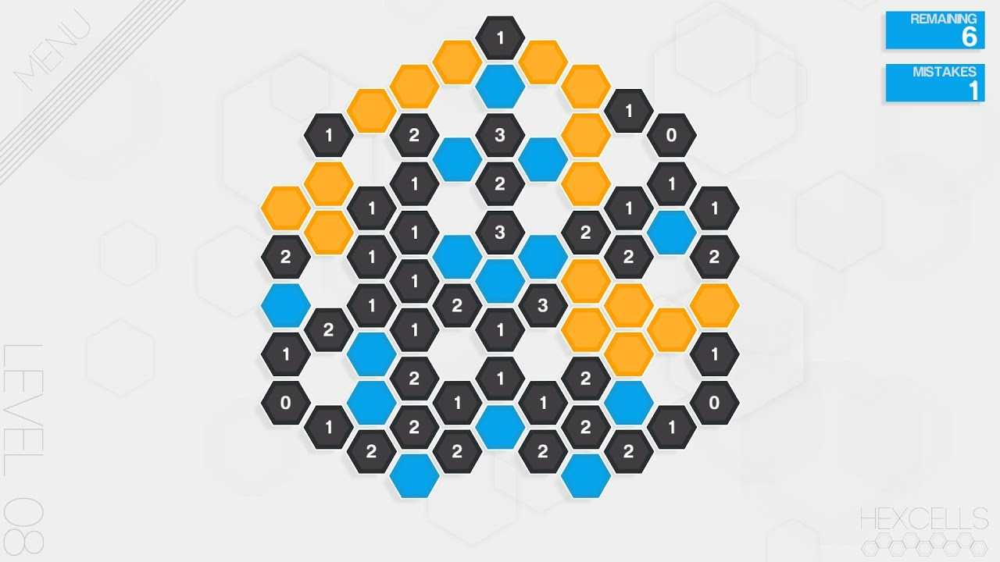

# Hexcells Solver



Hexcells is a puzzle game set on a 2D hexagonal grid where the player, like in Minesweeper, strategically mark mines (indicated by blue cells) and uncover neighboring cells (represented by black cells) using logic-driven hints to navigate the intricate layout.

The solver takes input in the form of an ASCII puzzle definition, as defined in https://github.com/oprypin/sixcells . Many fan-made puzzles can be found on https://www.reddit.com/r/hexcellslevels .

[This Gist](https://gist.github.com/Ngoguey42/a0f661c5cb36180a3a6aca4bb4d385b2/99b37bdf646d8dd76df6a1c26ea0d6acf4856219) is an inventory of the fan-made puzzles found on Reddit. They are ranked by difficulty, a metric determined through computation by the solver.

### Usage

##### Solve a grid on stdin
```sh
cat extra/the_trial.txt | hexcells-solver -
```

##### Solve all grids on reddit

```sh
hexcells-solver reddit-posts
```
